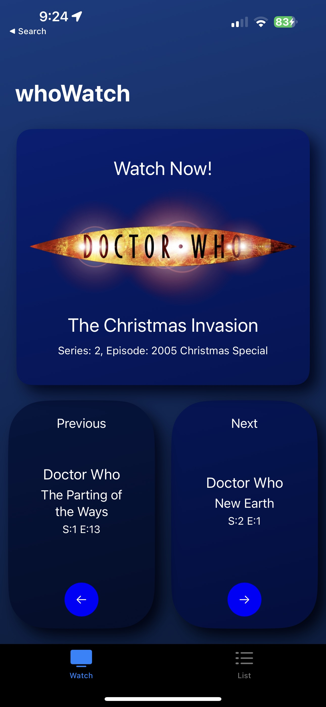
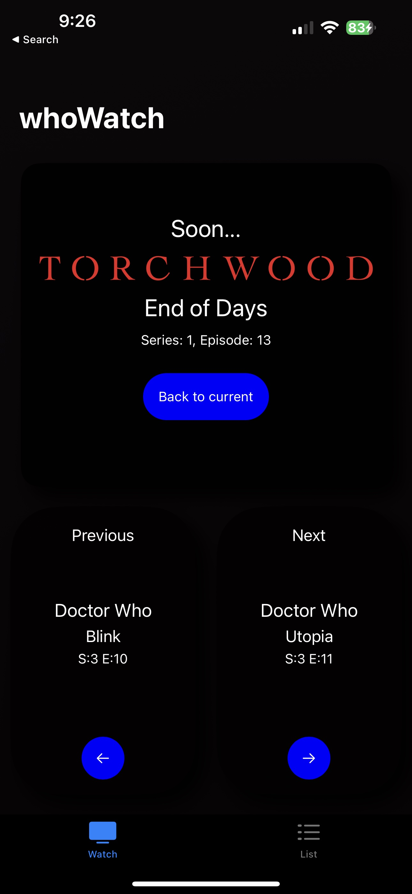
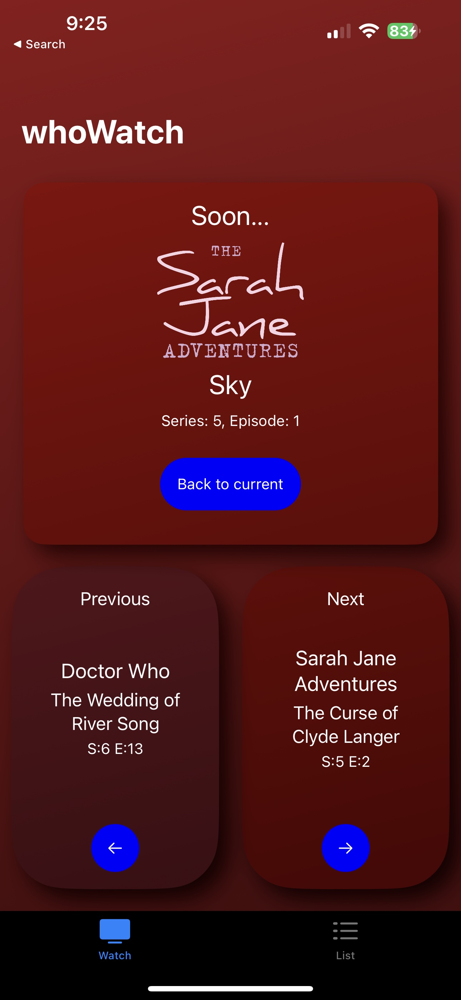
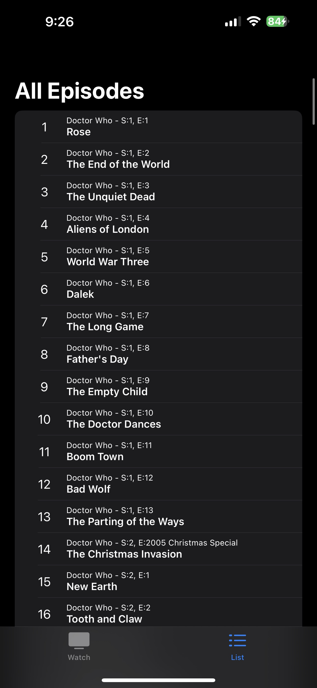

# whoWatch

An iOS application making use of SwiftUI to help users keep track of their viewing of the British television program [Doctor Who (2005-)](https://en.wikipedia.org/wiki/Doctor_Who) as well as it's two spin off shows, [Torchwood](https://en.wikipedia.org/wiki/Torchwood) and [The Sarah Jane Adventures](https://en.wikipedia.org/wiki/The_Sarah_Jane_Adventures).

## Preview

## Episode Order

whoWatch tracks all episodes that have aired of Doctor Who (2005-), Torchwood, and the Sarah Jane Adventures as of writing (2023-01-17).

Episodes of The Sarah Jane Adventures have been considered as single episodes as each was broadcast in two short parts (excluding the introductory episode [Invasion of the Bane](https://en.wikipedia.org/wiki/Invasion_of_the_Bane)).

All minisodes, comic relief specials, etc. have yet to be added, see Issue #7

The order used has been taken from [this](https://www.reddit.com/r/gallifrey/comments/2lbnk9/comment/cltfhlj/?utm_source=share&utm_medium=web2x&context=3) reddit comment, left by user [u/EveryGoodNameIsGone](https://www.reddit.com/user/EveryGoodNameIsGone/). With all episodes of Doctor Who that have aired since the comment was made, added in broadcast order.

The order is included here in case the original comment is ever lost.

  
Show

  
* Doctor Who Series 1
* Doctor Who: Born Again (2005 Children in Need short)
* Doctor Who: The Christmas Invasion (2005 Christmas Special)
* Doctor Who Series 2
* Torchwood Series 1, Episode 1-9
* Doctor Who: The Runaway Bride (2006 Christmas Special)
* Torchwood Series 1, Episode 10 (Out of Time)
* Doctor Who Series 3, Episodes 1-3
* Torchwood Series 1, Episode 11 (Combat)
* Doctor Who Series 3, Episodes 4-7
* Torchwood Series 1, Episode 12 (Captain Jack Harkness)
* Doctor Who Series 3, Episodes 8-10
* Doctor Who: The Infinite Quest (animated episode)
* Torchwood Series 1, Episode 13 (End of Days)
* Doctor Who Series 3, Episodes 11-13
* The Sarah Jane Adventures: Invasion of the Bane
* The Sarah Jane Adventures Series 1
* Doctor Who: Time Crash (2007 Children in Need Special)
* Doctor Who: Voyage of the Damned (2007 Christmas Special)
* Torchwood Series 2, Episodes 1-5
* Doctor Who Series 4, Episodes 1-3
* Torchwood Series 2, Episodes 6-8
* Doctor Who Series 4, Episodes 4-7
* Torchwood Series 2, Episodes 9-13
* Doctor Who Series 4, Episodes 8-13
* The Sarah Jane Adventures Series 2
* Doctor Who: The Next Doctor (2008 Christmas Special)
* Doctor Who: Planet of the Dead (2009 Easter Special)
* Torchwood: Children of Earth (Series 3)
* Doctor Who: Dreamland (animated episode)
* The Sarah Jane Adventures Series 3
* Doctor Who: The Waters of Mars (2009 November Special)
* Doctor Who: The End of Time (2009 Christmas Special)
* Doctor Who Series 5, Episode 1 (The Eleventh Hour)
* Doctor Who: Meanwhile in the TARDIS #1 (DVD/Blu-Ray short)
* Doctor Who Series 5, Episodes 2-5
* Doctor Who: Meanwhile in the TARDIS #2 (DVD/Blu-Ray short)
* Doctor Who Series 5, Episodes 6-9
* Doctor Who: Good as Gold (Doctor Who Confidential short) (moved up considerably due to Rory's absence)
* Doctor Who Series 5, Episodes 10-13
* The Sarah Jane Adventures Series 4
* Doctor Who: Death is the Only Answer (Doctor Who Confidential short)
* Doctor Who: A Christmas Carol (2010 Christmas Special)
* Torchwood: Miracle Day (Series 4)
* Doctor Who: Bad Night (DVD/Blu-Ray short)
* Doctor Who: Space and Time (2011 Comic Relief shorts)
* Doctor Who: Good Night (DVD/Blu-Ray short)
* Doctor Who: The Impossible Astronaut Prequel (web short)
* Doctor Who Series 6, Episodes 1-2
* Doctor Who: The Curse of the Black Spot Prequel (web short)
* Doctor Who Series 6, Episodes 3-6
* Doctor Who: A Good Man Goes to War Prequel (web short)
* Doctor Who Series 6, Episode 7 (A Good Man Goes to War)
* Doctor Who: The Battle of Demons Run, Two Days Later (web short)
* Doctor Who: Let's Kill Hitler Prequel (web short)
* Doctor Who Series 6, Episodes 8-11
* Doctor Who: Up All Night (DVD/Blu-Ray short)
* Doctor Who Series 6, Episode 12 (Closing Time)
* Doctor Who: The Wedding of River Song Prequel (web short)
* Doctor Who Series 6, Episode 13 (The Wedding of River Song)
* The Sarah Jane Adventures Series 5
* Doctor Who: The Doctor, the Widow, and the Wardrobe Prequel (web short)
* Doctor Who: The Doctor, the Widow, and the Wardrobe (2011 Christmas Special)
* Doctor Who: First Night and Last Night (DVD/Blu-Ray shorts)
* Doctor Who: Pond Life (web miniseries)
* Doctor Who: Asylum of the Daleks Prequel (web short)
* Doctor Who Series 7, Episode 1 (Asylum of the Daleks)
* Doctor Who: The Inforarium (DVD/Blu-Ray short)
* Doctor Who Series 7, Episode 2 (Dinosaurs on a Spaceship)
* Doctor Who: The Making of the Gunslinger (web short)
* Doctor Who Series 7, Episodes 3-5
* Doctor Who: P.S. (web short)
* Doctor Who: The Great Detective (2012 Children in Need short)
* Doctor Who: Vastra Investigates (web short)
* Doctor Who: The Snowmen (2012 Christmas Special)
* Doctor Who: The Bells of Saint John Prequel (web short)
* Doctor Who Series 7, Episodes 6-10 (or 7-11 if you count Snowmen as episode 6)
* Doctor Who: Clara and the TARDIS (DVD/Blu-Ray short)
* Doctor Who: Rain Gods (DVD/Blu-Ray short)
* Doctor Who Series 7, Episodes 11-12 (or 12-13 if you count Snowmen as episode 6)
* Doctor Who: He Said, She Said (web short)
* Doctor Who: Clarence and the Whispermen (DVD/Blu-Ray short)
* Doctor Who Series 7, Episode 13 (or 14 if you count Snowmen as episode 6) (The Name of the Doctor)
* Doctor Who: The Night of the Doctor (web short)
* Doctor Who: The Last Day (web short)
* Doctor Who: The Day of the Doctor (50th Anniversary Special)
* Doctor Who: The Time of the Doctor (2013 Christmas Special)
* Doctor Who Series 8
* Doctor Who: Last Christmas (2014 Christmas Special)
* Doctor Who Series 9
* Doctor Who: The Husbands of River Song (2015 Christmas Special)
* Doctor Who: The Return of Doctor Mysterio (2016 Christmas Special)
* Doctor Who Series 10
* Doctor Who: Twice Upon a Time (2017 Christmas Special)
* Doctor Who Series 11
* Doctor Who: Resolution (2019 New Years Day Special)
* Doctor Who Series 12
* Doctor Who: Revolution of the Daleks (2021 New Years Day Special)
* Doctor Who Flux (Series 13)
* Doctor Who: Eve of the Daleks (2022 New Years Day Special)
* Doctor Who: Legend of the Sea Devils (2022 Spring Special)
* Doctor Who: Revolution of the Daleks (BBC Centenary Special)
    

## Build

### Requirements

-   macOS 11.3 (Big Sur) or later.
-   Xcode 13 or later.
    -   Install from [Mac App Store](https://apps.apple.com/gb/app/xcode/id497799835?mt=12).
    -   If you have trouble with the App Store, try downloading directing from [developer.apple](https://developer.apple.com/download/all/?q=Xcode).

### Steps

-   Open [whoWatch.xcodeproj](https://github.com/BlueLinks/whoWatch/tree/main/whoWatch.xcodeproj) from the project direcotries root with Xcode.
-   The project should open and Xcode should begin to set up the environment (this may take some time).
-   Use the navigation bar at the top of the Xcode window to select a device for the simulator or connect an iOS device to deploy to.
    -   If deploying to a physical iOS device - without an Apple developer account, the app will become unavailable after a few days and will need to be reinstalled.
-   Build the application by clicking the play button (▶) in the navigation bar or using key command `command` + `r` (`⌘` + `r`).
